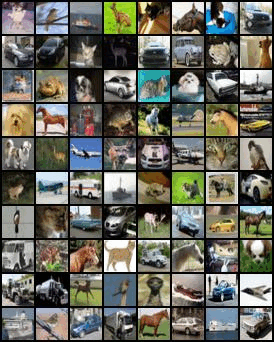

# OrientationDiffusion
Code for NeurIPS 2025 "Kuramoto Orientation Diffusion Models"

## CIFAR10 with 100 steps

| Forward Process |Backward Process |
|:-------------------------:|:-------------------------:|
| ||


## Image Generation

Check [train_orientation_diffusion.py](https://github.com/KingJamesSong/OrientationDiffusion/blob/main/train_orientation_diffusion.py)

## Unconditional PDE Generation

Check [train_nse.py](https://github.com/KingJamesSong/OrientationDiffusion/blob/main/train_nse.py)

## Conditional Image Generation

Check [train_nse_cond.py](https://github.com/KingJamesSong/OrientationDiffusion/blob/main/train_nse_cond.py)

## Citation

Please consider citing our paper if you think the code is helpful to your research.

```
@article{song2025kuramoto,
  title={Kuramoto Orientation Diffusion Models},
  author={Song, Yue and Keller, T. Anderson and Brodjian, Sevan and Miyato, Takeru and Yue, Yisong and Perona, Pietro and Welling, Max},
  journal={NeurIPS},
  year={2025}
}
```

